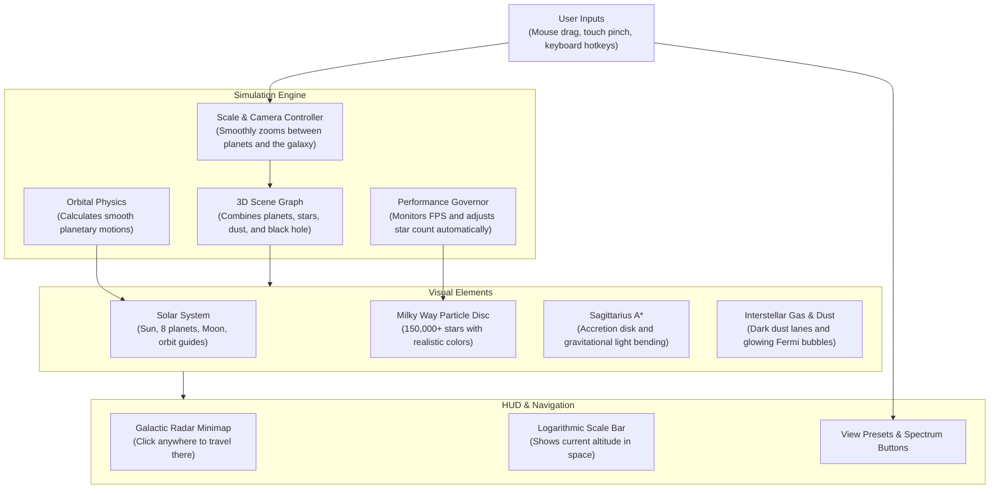
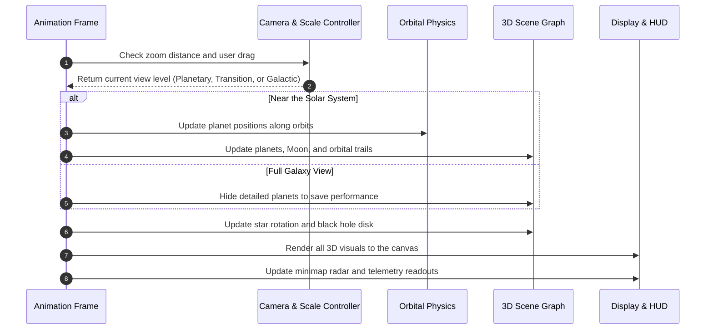
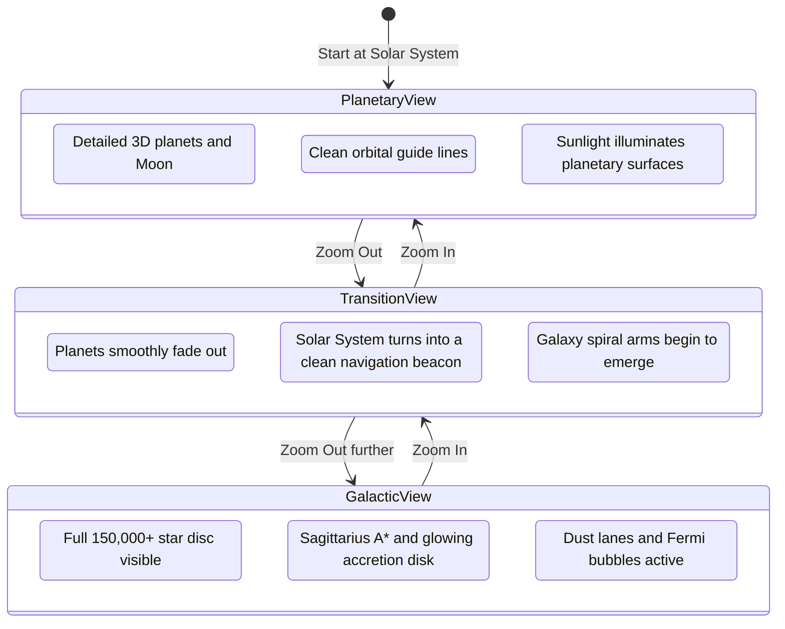

# Milky Way Simulator — System Architecture

A clear, practical overview of how the 3D Milky Way Galaxy and Solar System simulation works under the hood.

---

## Table of Contents

1. [Overview & Core Concept](#1-overview--core-concept)
2. [How the System Works Together](#2-how-the-system-works-together)
3. [Scientific & Visual Modeling](#3-scientific--visual-modeling)
   - [3.1 Handling Vast Space Scales](#31-handling-vast-space-scales)
   - [3.2 Drawing the Spiral Arms](#32-drawing-the-spiral-arms)
   - [3.3 Real Star Types and Colors](#33-real-star-types-and-colors)
   - [3.4 Galactic Rotation](#34-galactic-rotation)
   - [3.5 Sagittarius A* Black Hole](#35-sagittarius-a-black-hole)
   - [3.6 Cosmic Dust and Star Nurseries](#36-cosmic-dust-and-star-nurseries)
   - [3.7 Fermi Bubbles](#37-fermi-bubbles)
   - [3.8 The Mathematics Explained Simply](#38-the-mathematics-explained-simply)
4. [How Data Flows in the Simulation](#4-how-data-flows-in-the-simulation)
   - [4.1 Render Loop Sequence](#41-render-loop-sequence)
   - [4.2 Smooth Zoom Between Planets and the Galaxy](#42-smooth-zoom-between-planets-and-the-galaxy)
   - [4.3 Multi-Spectral View Modes](#43-multi-spectral-view-modes)
5. [Performance & Optimization](#5-performance--optimization)
   - [5.1 Keeping Frame Rates Smooth](#51-keeping-frame-rates-smooth)
   - [5.2 Dynamic Detail Levels](#52-dynamic-detail-levels)
6. [Build and Deployment](#6-build-and-deployment)

---

## 1. Overview & Core Concept

Space has an enormous scale problem. The distance from Earth to the Sun is about 150 million kilometers, but our galaxy spans 100,000 light-years across. 

In standard 3D engines, putting both in the exact same coordinates causes numbers to become so large that small objects like planets begin to shake and jitter. 

This simulator solves that challenge by using two connected coordinate scales. You can smoothly fly from a close view of Earth, the Moon, and the planets, all the way out into deep space to see the entire rotating spiral galaxy and its central supermassive black hole.

### Key Goals

* **Scientific Realism:** Spiral arms follow natural density wave patterns, stars use real astronomical color temperatures, and the central black hole bends light realistically.
* **Fluid Dual-Scale Flight:** Moving between a single planet and the full galaxy feels seamless and natural.
* **Smooth Browser Performance:** Runs in any modern web browser without lag or stutters.
* **Multiple Wavelength Views:** Switch between visible light, infrared, and radio views to see how astronomers study the cosmos.

---

## 2. How the System Works Together

The diagram below shows how input, physics, 3D graphics, and user controls communicate:

---

## 3. Scientific & Visual Modeling

### 3.1 Handling Vast Space Scales

To keep 3D graphics stable and sharp at every distance, space is split into two connected reference frames:

1. **Local Solar System Frame:** Used when you are close to the Sun. Planets, orbits, and moons are placed here with fine precision.
2. **Galactic Frame:** Used when you zoom out into deep space. The Sun is placed inside the Orion Spur, roughly 26,000 light-years (8.2 kpc) away from the center of the galaxy.

As you zoom out past the outer planets, the camera smoothly transitions to galactic scale, and the Solar System turns into a clean, glowing navigation beacon.

---

### 3.2 Drawing the Spiral Arms

Galactic spiral arms are not rigid structures like fan blades. Instead, they are traveling waves of higher density that stars, gas, and dust pass through over millions of years.

The galaxy is modeled with four major spiral arms and one local bridge:
* **Perseus Arm**
* **Scutum-Centaurus Arm**
* **Sagittarius Arm**
* **Outer (Norma) Arm**
* **Orion Spur:** The local arm where our Sun and Solar System reside.

Each arm curves outward logarithmically, with stars clustered naturally along the arm and gently flaring outward toward the edges of the galaxy.

---

### 3.3 Real Star Types and Colors

Stars in the galaxy are not just plain white dots. They follow real astronomical classifications based on surface temperature (the Morgan-Keenan scale):

| Type | Surface Temp | Color in Simulation | Where They Appear |
| :---: | :---: | :---: | :--- |
| **O** | $> 30,000\text{ K}$ | Deep Blue | Bright star-forming pockets along spiral arms |
| **B** | $10,000 - 30,000\text{ K}$ | Blue-White | Active spiral arms |
| **A** | $7,500 - 10,000\text{ K}$ | Pure White | Young outer disc regions |
| **F** | $6,000 - 7,500\text{ K}$ | Yellow-White | General stellar disc |
| **G** | $5,200 - 6,000\text{ K}$ | Warm Solar Yellow | Common stars like our Sun |
| **K** | $3,700 - 5,200\text{ K}$ | Orange | Denser central bulge regions |
| **M** | $2,400 - 3,700\text{ K}$ | Red | Abundant red dwarfs spread across the entire galaxy |

Each star's color is calculated from its blackbody temperature, creating a realistic, glowing galactic disc.

---

### 3.4 Galactic Rotation

In our Solar System, outer planets orbit much slower than inner planets because the Sun holds almost all the mass. 

In a galaxy, however, outer stars orbit at nearly the same speed as inner stars (around 220 km/s). This flat rotation curve was historically the primary evidence for dark matter. The simulation incorporates this flat rotation profile so the spiral arms stay coherent and natural over time without winding up into a tight knot.

---

### 3.5 Sagittarius A* Black Hole

At the very center of the Milky Way sits Sagittarius A*, a supermassive black hole with over 4 million times the mass of our Sun.

The black hole is modeled with real relativistic features:
* **Event Horizon:** The dark circular boundary where gravity is so strong that even light cannot escape.
* **Photon Sphere:** A thin ring just outside the horizon where light rays loop around the black hole before escaping toward the camera.
* **Accretion Disk:** A glowing disk of superheated gas and plasma swirling inward.
* **Gravitational Lensing:** Strong gravity bends the light coming from stars behind the black hole, creating an Einstein ring effect.
* **Doppler Beaming:** The side of the disk rotating toward the camera appears brighter and slightly bluer, while the side moving away appears dimmer and redder.

---

### 3.6 Cosmic Dust and Star Nurseries

* **Dust Lanes:** Dark, curving bands of interstellar carbon and silicate dust run along the inner edges of the spiral arms. In visible light, these clouds block background starlight, just like the Great Rift seen in the real night sky.
* **Star Nurseries:** Glowing reddish clouds of ionized hydrogen gas (like the Orion Nebula) are scattered along the arms where brand-new stars are actively forming.
* **The Local Bubble:** Our Sun sits inside a low-density cavity in space cleared out by ancient supernovae. The simulation keeps a clear space around the Solar System so local views remain unobstructed.

---

### 3.7 Fermi Bubbles

Extending roughly 25,000 light-years above and below the center of the galaxy are two giant bubbles of high-energy gas called the Fermi Bubbles. These were blown out of the core by past eruptions from Sagittarius A* and glow faintly in high-energy wavelengths.

---

### 3.8 The Mathematics Explained Simply

Here is a straightforward look at the three core equations powering the deep-space simulation, explained with everyday analogies:

#### 1. The Spiral Arm Equation (Logarithmic Spiral)

To give the Milky Way its natural pinwheel shape without letting the arms tangle, each spiral arm follows a logarithmic curve:

$$r(\theta) = r_0 \cdot e^{b \cdot \theta}$$

* **What it means in plain English:**
  * $r$ is how far a star is from the galactic center.
  * $\theta$ is the angle turning around the center (like the hand of a clock).
  * $b$ is the "pitch angle"—it controls how tightly or loosely the arm uncurls.
  * $e$ is Euler's constant ($2.718...$), which makes the arm expand outward smoothly at an even proportion.
* **The Real-World Analogy:**
  Think of a spinning lawn sprinkler or a nautilus shell. As water sprays outward while the head rotates, it creates a spiral trail. In a galaxy, stars and gas clouds continuously flow through these curving density waves, creating bright compression crests that our eyes see as spiral arms.

---

#### 2. The Dark Matter Rotation Formula (Why Outer Stars Don't Slow Down)

In our Solar System, distant planets crawl slowly around the Sun because almost all the mass is in the center. But in the Milky Way, distant stars race around the center just as fast as inner stars ($\approx 220\text{ km/s}$):

$$v(r) = \sqrt{\frac{G \cdot M(r)}{r}} \approx \text{constant}$$

* **What it means in plain English:**
  * $v(r)$ is the orbital speed of a star at distance $r$.
  * $G$ is Newton's gravitational constant.
  * $M(r)$ is the total mass contained inside that star's orbit.
  * If stars were the only mass, $M(r)$ would stop growing, and outer speeds would drop toward zero. Because speeds stay flat, $M(r)$ must keep growing steadily as distance $r$ increases ($M(r) \propto r$).
* **The Real-World Analogy:**
  Imagine riders on a spinning carousel. In a normal gravitational system, outer horses would have to move slower. But the Milky Way behaves like a solid spinning turntable, because an invisible scaffolding of dark matter surrounds the entire disc, pulling outer stars along at high speed.

---

#### 3. Black Hole Light Bending (Einstein's Gravitational Lensing)

Near Sagittarius A*, gravity is so immense that it bends the path of light rays passing nearby:

$$\alpha \approx \frac{4 \cdot G \cdot M}{c^2 \cdot b}$$

* **What it means in plain English:**
  * $\alpha$ is the bending angle of the light ray.
  * $M$ is the black hole's mass (over 4 million times our Sun).
  * $c$ is the speed of light.
  * $b$ is how close the light ray passes to the center (the "impact distance").
  * The closer light passes ($b$ gets smaller), the sharper the light bends.
* **The Real-World Analogy:**
  Hold the curved circular base of a wine glass up to a light bulb. The curved glass bends the light rays inward, smearing background objects into glowing rings and mirrored arcs. The black hole's gravity warps space just like that glass, creating the glowing Einstein ring and bright photon sphere around its dark shadow.

---

## 4. How Data Flows in the Simulation

### 4.1 Render Loop Sequence

Every frame (roughly 60 times a second), the simulation completes a quick sequence of updates:

---

### 4.2 Smooth Zoom Between Planets and the Galaxy

The camera system handles three natural states:

---

### 4.3 Multi-Spectral View Modes

Astronomers study galaxies across different wavelengths because light reveals different cosmic structures. You can switch between three modes at any time:

1. **Visible (Key V):** The view as human eyes would see it from deep space. Shows natural star colors and dark, opaque dust lanes.
2. **Infrared (Key I):** Infrared light passes right through interstellar dust. Dust clouds glow with warm re-emitted heat, revealing the dense swarm of stars packed into the galactic center.
3. **Radio (Key R):** Highlights high-energy magnetic fields, synchrotron radiation from the Fermi Bubbles, and plasma jets near Sagittarius A*.

---

## 5. Performance & Optimization

### 5.1 Keeping Frame Rates Smooth

To ensure the simulation runs smoothly across both desktop computers and mobile devices:

* **Single-Batch Star Rendering:** All 150,000+ stars are rendered in a single GPU draw call rather than thousands of individual objects.
* **Smart Memory Usage:** Math calculations reuse memory buffers rather than creating new objects each frame, preventing stutter from garbage collection.
* **Logarithmic Depth Buffer:** Eliminates visual flickering (z-fighting) when viewing small planets up close or enormous galaxies far away.

---

### 5.2 Dynamic Detail Levels

The simulator monitors frame times continuously. If a device has a slower graphics chip, it automatically adjusts detail to keep the experience smooth:

* **High Tier (Desktops / Fast GPUs):** Full 150,000 stars, high pixel resolution, long planetary orbit trails.
* **Medium Tier (Laptops):** 75,000 stars, balanced resolution.
* **Low Tier (Phones / Mobile):** 35,000 stars, optimized resolution for smooth 60 FPS touch interaction.

---

## 6. Build and Deployment

* **Bundling:** Vite packages the TypeScript source code and assets into optimized web bundles.
* **Deployment:** Pushing updates to the `master` branch automatically triggers GitHub Actions to build the site and deploy it directly to GitHub Pages at `https://vkshdev.github.io/Milky-Way/`.
