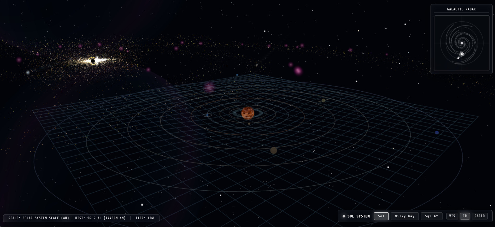

# Milky Way Galaxy **[Live](https://vkshdev.github.io/Milky-Way/)**

A real-time simulation of the Milky Way Galaxy and the Solar System.  
Explore 100,000 light-years of space, from planetary orbits around the Sun to the realistic accretion disk of Sagittarius A*.

---

## Controls & Hotkeys

| Key / Input | Action |
| :--- | :--- |
| **`1`** | Focus Solar System (Orion Spur) |
| **`2`** | Galactic Overview (Milky Way macroscopic view) |
| **`3`** | Focus Sagittarius A\* (Galactic Core) |
| **`V`** | Visible spectrum mode (true blackbody colors) |
| **`I`** | Infrared spectrum mode (dust penetration) |
| **`R`** | Radio / High-Energy mode (synchrotron emission) |
| **`P`** | Cycle Performance Tier (High / Medium / Low) |
| **Left Click + Drag** | Orbit camera around target |
| **Right Click + Drag** | Pan camera |
| **Scroll Wheel** | Zoom in / out |
| **Radar Click** | Click anywhere on the 2D radar to jump to that coordinate |

---